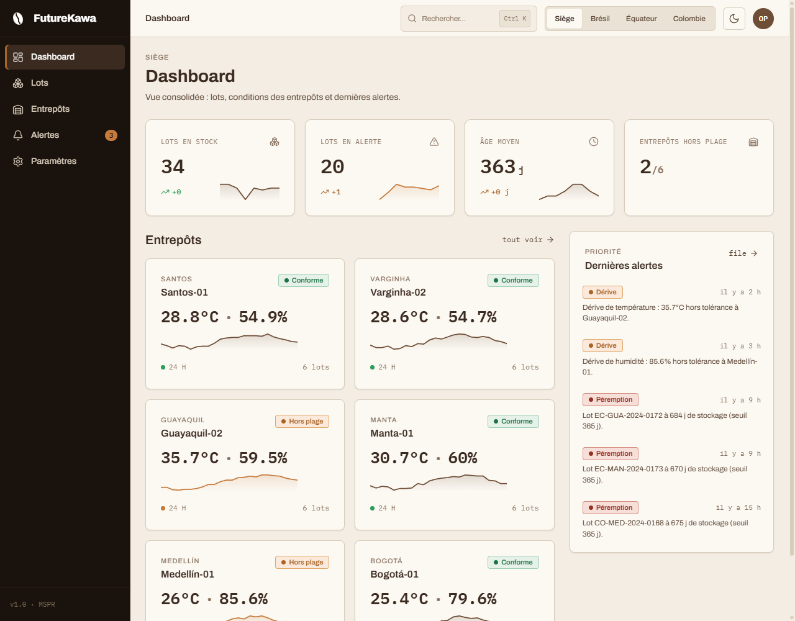
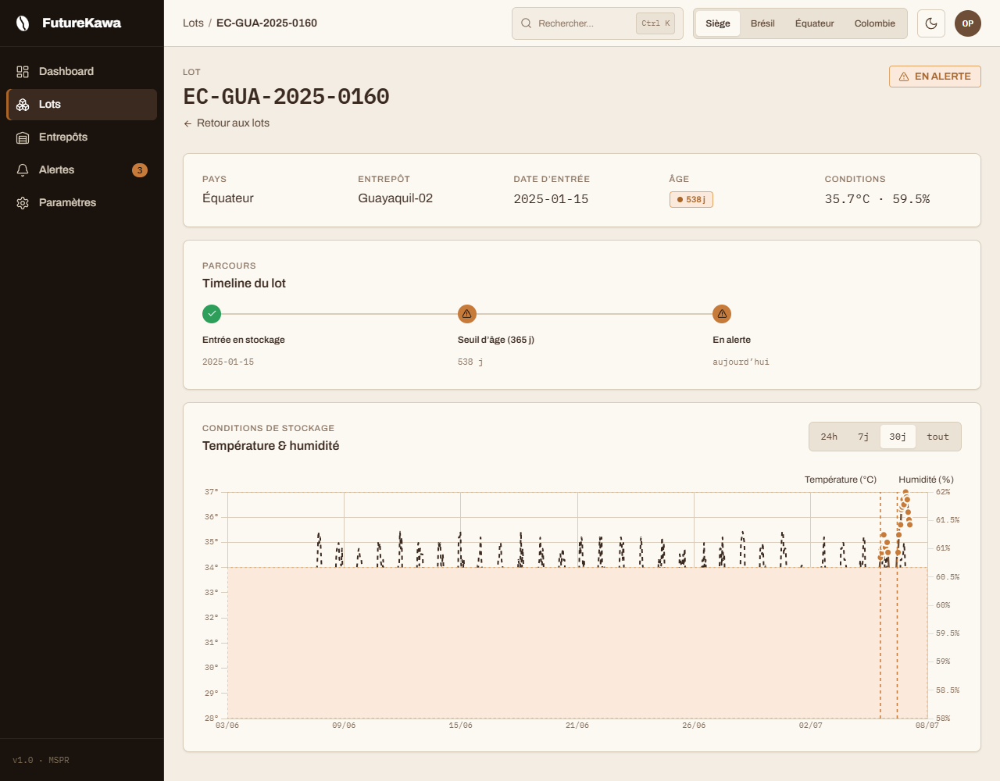
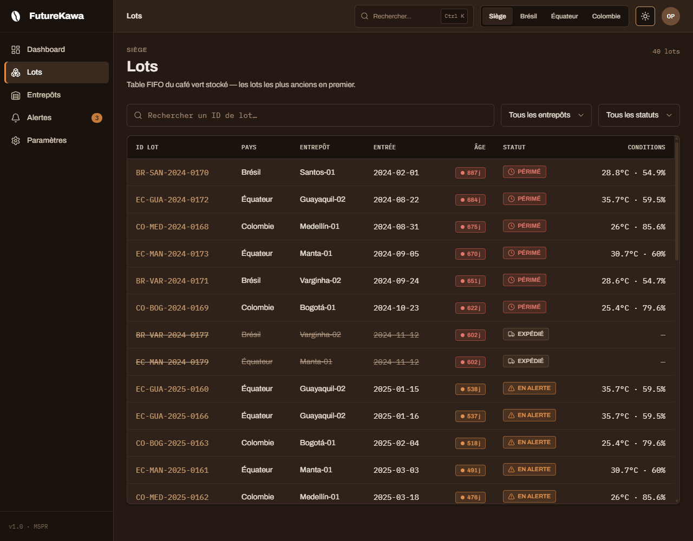

# Headquarters Frontend

Web app for **FutureKawa** — supervision of green-coffee lots and IoT storage
conditions across warehouses in Brazil, Ecuador and Colombia. It consumes the
central HQ REST API (which aggregates the per-country backends) and consolidates
the three countries into a single HQ view.

Built strictly on the imported **Charte FutureKawa** design system: every colour
comes from `--fk-*` CSS tokens, Archivo + IBM Plex Mono are self-hosted, and the
UI ships light (default) and dark themes.

## Screenshots

| Dashboard (light) | Lot detail — temp/humidity chart |
|---|---|
|  |  |

| Lots — FIFO table (dark) |
|---|
|  |

## Stack

- **React 18 + Vite + TypeScript**, `react-router` (data router, code-split routes)
- **Chart.js** via `react-chartjs-2` + `chartjs-plugin-annotation` (temperature /
  humidity curves) — lazy-loaded
- **CSS custom properties** for design tokens (no CSS framework); two themes via
  `data-theme` on `<html>`, persisted to `localStorage`
- **lucide-react** icons (stroke 1.75, always labelled)
- **MSW** (Mock Service Worker) for a fully offline, seeded mock backend
- **Vitest + React Testing Library** for unit tests
- **oxc toolchain** — [oxlint](https://oxc.rs) (lint) + [oxfmt](https://oxc.rs) (format), Rust-based & fast

## Getting started

```bash
npm install        # also downloads dev tooling
npm run dev        # http://localhost:5173
```

The app boots on the MSW mock layer by default — no backend required.

### Scripts

| Script | Purpose |
|---|---|
| `npm run dev` | Start the Vite dev server |
| `npm run build` | Type-check (`tsc -b`) and build for production |
| `npm run preview` | Preview the production build locally |
| `npm test` | Run the Vitest suite once |
| `npm run test:watch` | Run tests in watch mode |
| `npm run typecheck` | Type-check only (`tsc -b`) |
| `npm run lint` | Lint with oxlint |
| `npm run format` | Format in place with oxfmt |
| `npm run format:check` | Check formatting (CI: fails if unformatted) |

## Environment

Configuration is build-time (Vite inlines `VITE_*`). See `.env.example`.

| Variable | Default | Meaning |
|---|---|---|
| `VITE_USE_MOCKS` | `true` | Boot the MSW mock layer instead of a real API |
| `VITE_API_URL` | _(empty)_ | Base URL of the central HQ API (real-backend mode) |

Switching from mocks to a real backend is a single change: set
`VITE_USE_MOCKS=false` and `VITE_API_URL=https://…`. The API client and endpoints
already target the documented contract.

## API contract

```
GET  /api/pays                          → countries + thresholds
GET  /api/lots?pays=&entrepot=&statut=  → lots, FIFO-sorted (oldest first)
GET  /api/lots/:id                      → lot detail
GET  /api/lots/:id/mesures?periode=     → temp/humidity time series
GET  /api/entrepots?pays=               → warehouses + last measure + status
GET  /api/entrepots/:id                 → warehouse detail
GET  /api/entrepots/:id/mesures?periode= → warehouse time series
GET  /api/alertes?pays=&traitee=        → alerts
POST /api/alertes/:id/traiter           → mark an alert handled
```

## Project structure

```
src/
  assets/brand/   the 4 official logo SVGs (used verbatim)
  styles/         tokens.css (source of truth), base.css, fonts.css
  components/ui/  primitives (Button, Badge, Card, Table, Modal, Toast,
                  Tabs, Input, Select, Skeleton, EmptyState, CommandPalette…)
  components/metier/  domain widgets (LotStatusBadge, TempHumidityChart,
                  ConditionsGauge, WarehouseCard, LotTimeline, KpiCard,
                  Sparkline, AlertItem, CountrySelector, LiveIndicator)
  layouts/        AppLayout (sidebar + topbar + breadcrumb + ⌘K + hotkeys)
  pages/          Dashboard, Lots, LotDetail, Entrepots, EntrepotDetail,
                  Alertes, Parametres, NotFound (+ StyleGuide, ComponentsGallery)
  api/            client.ts (fetch wrapper) + typed endpoint modules
  mocks/          seeded dataset + MSW handlers + worker
  hooks/          theme, country filter, useAsync, usePolling, useHotkeys
  lib/            countries, warehouses, conditions (pure logic), format
```

Two internal design-system references live at `/design` (tokens) and
`/design/components` (component gallery).

## Keyboard shortcuts

| Keys | Action |
|---|---|
| `⌘K` / `Ctrl+K` | Command palette (search lots, warehouses, pages, actions) |
| `/` | Open search |
| `t` | Toggle theme |
| `g` then `d` / `l` / `e` / `a` / `p` | Go to Dashboard / Lots / Entrepôts / Alertes / Paramètres |

## Testing

```bash
npm test
```

Covers the critical domain logic and components: lot status / FIFO sort /
out-of-range logic (`conditions`), `LotStatusBadge`, `ConditionsGauge`
in/out-of-band behaviour, and the URL-synced `useCountryFilter`.

## Docker

Multi-stage build (Vite → nginx), self-contained offline demo:

```bash
docker compose up --build   # http://localhost:8080
# or
docker build -t futurekawa-hq-frontend .
docker run -p 8080:80 futurekawa-hq-frontend
```

For a real backend: `docker build --build-arg VITE_USE_MOCKS=false --build-arg VITE_API_URL=https://api… .`

## Decisions

- **Tokens are the single source of truth.** No component hard-codes a colour;
  everything reads `var(--fk-*)`. Chart.js (canvas) reads the computed token
  values and re-renders on theme change.
- **Light theme is the default** (per the charte); dark is one toggle away and
  persisted. First visit uses light rather than the system preference, to match
  the charte's stated default.
- **The sidebar is an always-dark espresso rail** in both themes, so the white
  logo variant always applies and the app keeps a strong, consistent frame
  (Linear/Grafana-style). Topbar and content follow the active theme.
- **The "caramel trap".** Caramel `#C77B3B` fails AA as small text on ivory, so
  it is used only for pastilles, borders, fills and the single primary action;
  orange *text* uses `--fk-cta` `#A96428`. One caramel action per screen.
- **Mocks are deterministic.** A seeded PRNG plants two sustained drifts
  (Guayaquil-02 temperature, Medellín-01 humidity) so alerts are always visible
  and stable across reloads; healthy warehouses stay inside their tolerance band.
- **Chart tolerance band vs. dual axes.** The caramel band renders on the
  temperature axis; humidity tolerance is shown as dashed boundary lines to keep
  the dual-axis chart readable. Alert annotations mark *sustained* drift only.
- **Live polling** on warehouse detail refetches every 30 s (pauses when the tab
  is hidden). With the static mock dataset the values are stable; the mechanism
  and the live indicator are what a real feed would drive.
- **Code splitting.** Every route and the Chart.js bundle are split, so the
  initial payload stays small; the chart chunk loads only when a chart is shown.
