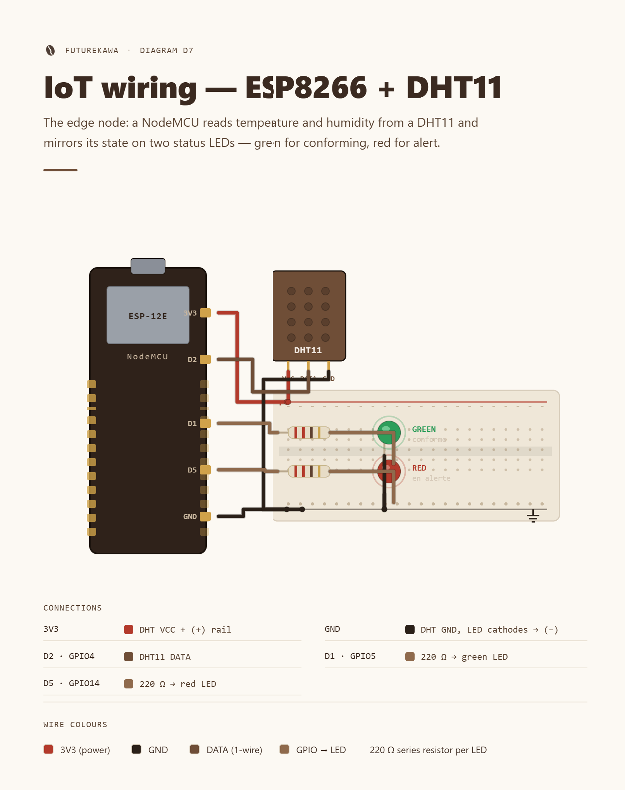
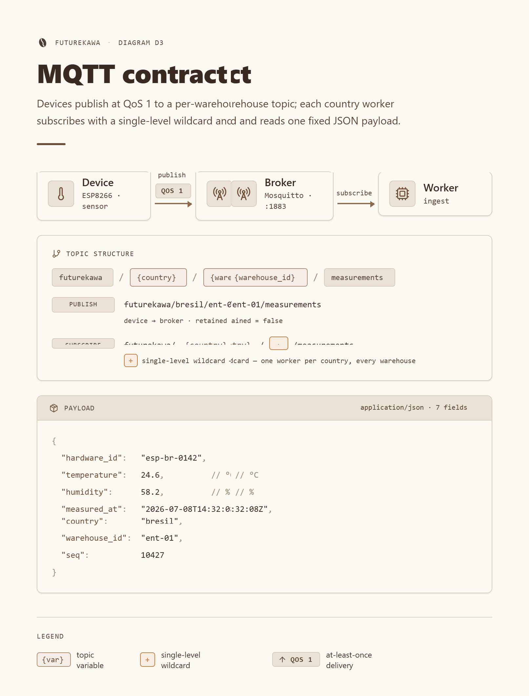

# 🌡️ IoT design — the sensing layer

How FutureKawa senses green-coffee storage conditions on the ground: the physical
node (**ESP8266 + DHT11**), the **MQTT contract** it speaks, the **resilience**
strategy behind it, and the **country-agnostic Python simulator** that replays the
exact same contract for a reproducible demo.

This layer sits at the far edge of the [distributed architecture](overview.md):
a sensor publishes to a per-country **Mosquitto** broker, an ingest worker persists
the readings, and alert logic lives in the country backend — **not** on the device.
The node is deliberately **publish-only**.

## 📑 Table of contents

- 🧭 [Overview](#-overview)
- 🔌 [Wiring & hardware](#-wiring--hardware)
- 🧠 [Hardware choice, limits & risks](#-hardware-choice-limits--risks)
- 📡 [MQTT protocol](#-mqtt-protocol)
- 🔁 [Reconnection & error strategy](#-reconnection--error-strategy)
- 🛰️ [The simulator pivot](#-the-simulator-pivot)
- 🔗 [Related docs](#-related-docs)

## 🧭 Overview

A single IoT node is one **NodeMCU ESP8266** microcontroller reading temperature
and humidity from one **DHT11** sensor, publishing a JSON measurement over Wi-Fi
every **30 s** via **MQTT**. Two on-board status LEDs report the node's health
locally (🟢 green = everything OK, 🔴 red = a fault). The firmware is written in
C++ on the **Arduino** framework and built with **PlatformIO**.

| Property | Value |
|---|---|
| 🧠 Board | NodeMCU **ESP8266** (`nodemcuv2`) |
| 🌡️ Sensor | **DHT11** temperature + humidity (single sensor, single read) |
| 🛠️ Toolchain | **PlatformIO** (build · flash · serial monitor @ 115200 baud) |
| 📶 Transport | Wi-Fi (station mode) → **MQTT** over TCP, port `1883` |
| ⏱️ Cadence | one reading every **30 s** |
| 🎯 Role | **publish-only** — no subscribe, no on-device alerting |

> 💡 Source of truth: firmware [`apps/country/iot/src/main.cpp`](../../apps/country/iot/src/main.cpp)
> and app README [`apps/country/iot/README.md`](../../apps/country/iot/README.md).

## 🔌 Wiring & hardware

The node exposes three things to the outside world: the DHT11 data line and two
status LEDs. Pins below are confirmed from the firmware (`#define` block in
`main.cpp`) — labelled with the NodeMCU silkscreen name and the underlying GPIO.

| Component / signal | NodeMCU pin | GPIO | Wiring |
|---|---|---|---|
| 🌡️ DHT11 data (`S`) | `D2` | GPIO4 | direct to the sensor data line |
| ⚡ DHT11 power (`+`) | `3V3` | — | 3.3 V |
| ⚡ DHT11 ground (`−`) | `GND` | — | ground |
| 🟢 Green LED — OK | `D1` | GPIO5 | 220 Ω → LED → GND |
| 🔴 Red LED — fault | `D5` | GPIO14 | 220 Ω → LED → GND |

**Exactly one LED is lit at any time**: green once Wi-Fi + broker + read + publish
all succeed, red on any fault (no Wi-Fi, no broker, or a failed sensor read).

### 📚 Firmware libraries

Pinned in [`platformio.ini`](../../apps/country/iot/platformio.ini):

| Concern | Library | Version | Used for |
|---|---|---|---|
| MQTT client | `256dpi/MQTT` | `^2.5` | connect + **publish with QoS 1** |
| DHT sensor | `beegee-tokyo/DHT sensor library for ESPx` (`DHTesp`) | `^1.18` | one read → both temp + humidity (`DHTesp::DHT11`) |
| JSON | `bblanchon/ArduinoJson` | `^7` | serialize the measurement payload |

### 🖼️ Wiring diagram



> 📸 **[SCREENSHOT]** — PlatformIO serial monitor @ 115200 baud showing the node
> booting: `WiFi connected`, `MQTT connected`, then repeating `PUB
> futurekawa/brazil/wh-01/measurements -> {…} [ok]` lines, with the 🟢 green status
> LED lit on the breadboard.

## 🧠 Hardware choice, limits & risks

The MSPR brief suggested an ESP32 + DHT22; the team built on the **ESP8266 + DHT11**
actually on hand. That trade is honest and defensible for a prototype.

| ✅ Why ESP8266 + DHT11 | ⚠️ Limits & risks |
|---|---|
| **Low cost** — cheap, widely cloned dev boards | **DHT11 precision** — ±2 °C / ±5 %, 1 °C/1 % resolution (DHT22 is finer). Enough to detect the ±3 °C / ±2 % drift band, but coarse. |
| **Built-in Wi-Fi** — no extra radio/gateway to publish MQTT | **Flaky solder / breadboard** — un-soldered headers or a cold joint silently kill the sensor line (`DHT read error: TIMEOUT`). |
| **Availability** — in stock, well-documented, huge community | **CH340 USB driver** — clone boards need an *older* CH340 driver on Windows; the newest one bricks flashing (`PermissionError 31`). |
| **DHT11 covers the ranges** the coffee storage bands need | **Field networks** — school Wi-Fi client-isolation / firewalls block port 1883; a dead DHT11 or a bad USB cable stalls the whole node. |

> ⚠️ These are exactly the failure modes that motivated a software fallback (see
> [the simulator pivot](#-the-simulator-pivot)). Full field notes live in the app
> [troubleshooting table](../../apps/country/iot/README.md#troubleshooting).

## 📡 MQTT protocol

The node and the simulator both speak the **same contract**, the source of truth
being [`packages/contracts/mqtt/measurements.md`](../../packages/contracts/mqtt/measurements.md).
A JSON schema (`measurement.schema.json`) validates the payload.

### 🧭 Topic

```
futurekawa/<country>/<warehouse_id>/measurements
```

- `<country>` — `brazil` · `ecuador` · `colombia`
- `<warehouse_id>` — e.g. `wh-01`
- Example: `futurekawa/brazil/wh-01/measurements`

A warehouse may host **several devices**; they all publish to the same topic and
consumers tell them apart by `hardware_id`.

### ⚙️ Publish parameters

| Parameter | Value |
|---|---|
| QoS | **1** — at least once |
| Retain | `false` |
| Frequency | one message every **30 s** |
| Broker port | `1883` |

### 📦 Payload

```json
{
  "warehouse_id": "wh-01",
  "country": "brazil",
  "model": "DHT11",
  "hardware_id": "ref43320",
  "temperature": 27.4,
  "humidity": 58.0,
  "timestamp": 1751808000
}
```

| Field | Type | Unit / notes |
|---|---|---|
| `warehouse_id` | string | Warehouse identifier |
| `country` | string | `brazil` \| `ecuador` \| `colombia` |
| `model` | string | Sensor model, e.g. `DHT11` |
| `hardware_id` | string | Unique device reference, e.g. `ref43320` |
| `temperature` | number | °C |
| `humidity` | number | % relative humidity |
| `timestamp` | integer | UNIX epoch seconds, UTC — device clock via **NTP** (the backend may re-stamp on receipt) |

> 💡 The **simulator** emits the full 7-field payload above. The current
> **firmware** emits the core set — `warehouse_id`, `country`, `temperature`,
> `humidity`, `timestamp` — and does not yet attach `model` / `hardware_id`
> (single-device-per-topic assumption). Both satisfy the topic + QoS contract;
> aligning the firmware to the full field set is a small, tracked follow-up.



## 🔁 Reconnection & error strategy

Field networks are flaky, so the layer is built to **degrade, not crash**. The two
publishers apply the same principles through different mechanics.

| Concern | 🔌 Firmware (ESP8266) | 🛰️ Simulator (Python) |
|---|---|---|
| Delivery | **QoS 1**, retain `false` | **QoS 1**, retain `false` |
| Wi-Fi / transport | reconnect attempted every loop when dropped; 20 s connect window, then retry | n/a (host network) |
| Broker reconnect | `connectMQTT()` re-attempted whenever `mqtt.connected()` is false; `mqtt.loop()` keeps the link alive | connect **retries 10×** with a **2 s backoff**, then raises; `keepalive=60` + paho background loop auto-reconnects |
| Sensor / publish error | failed read or `NaN` → **skip this cycle**, no bad data sent | — |
| Health signal | **status LEDs** (🟢 OK / 🔴 fault), exactly one lit | structured stdout log per round |
| Clock | UTC via **NTP** (`pool.ntp.org`) on Wi-Fi connect | host UTC clock |
| Shutdown | continuous loop | **SIGINT/SIGTERM** → clean `disconnect()` |

**QoS 1** and **auto-reconnect with backoff** are confirmed in both code paths.

> ⚠️ **Last-will (LWT)**: an MQTT last-will testament is part of the resilience
> *intent* at the architecture level, but is **not yet registered** by the current
> firmware or simulator — the node instead signals faults **locally** via the
> 🟢/🔴 LEDs. Wiring a broker-side LWT (so the backend learns of a silent node) is a
> planned, low-risk addition, tracked alongside the payload field alignment above.

## 🛰️ The simulator pivot

Because clone-board hardware is fragile (cold solder joints, the CH340 driver
saga, a dead DHT11, blocked field Wi-Fi), the team added a **country-agnostic
Python simulator** that **replays the exact same MQTT contract**. This is an
**engineering decision for a reliable demo**, not a workaround for a failure: it
decouples backend development from hardware availability and guarantees a
reproducible run for the jury.

| Property | Detail |
|---|---|
| 🐍 Stack | Python 3.12, **`paho-mqtt`**, `pydantic-settings`, managed by **`uv`** |
| 🌍 Scope | **one instance per country** — Brazil, Ecuador, Colombia |
| ⚙️ Config | **100 % environment-driven** (`COUNTRY`, `DEVICES` JSON, thresholds, `PUBLISH_INTERVAL`) — **add a country with no code change** |
| 📈 Realism | smooth **random walk** with mean reversion around each country's threshold; `ANOMALY_PROBABILITY` pushes readings **beyond tolerance** to trigger real backend alerts |
| 🎲 Reproducible | `RANDOM_SEED` makes a run deterministic for demos and tests |
| ✅ Quality | `pytest` suite gated at **80 % coverage** (currently ~98 %) |

The backend **cannot tell the simulator from a real device** — same topic, same
QoS, same JSON. The full fleet (broker + the three countries) comes up with a
single command:

```bash
cd apps/country/iot/simulator
docker compose up --build
```

> 💡 Full simulator docs, env matrix and `DEVICES` examples:
> [`apps/country/iot/simulator/README.md`](../../apps/country/iot/simulator/README.md).
> Running it inside the country stack: [running the stack](../deployment/running-the-stack.md).

## 🔗 Related docs

- [Architecture overview](overview.md) — where the sensing layer sits end-to-end.
- [Distributed system](distributed-system.md) — topology, sovereignty, resilience.
- [MQTT contract](../../packages/contracts/mqtt/measurements.md) — canonical payload + schema.
- [IoT firmware README](../../apps/country/iot/README.md) — wiring, flashing, troubleshooting.
- [IoT simulator README](../../apps/country/iot/simulator/README.md) — env config + how it works.
- [Running the stack](../deployment/running-the-stack.md) — bring up the broker + country stack.
