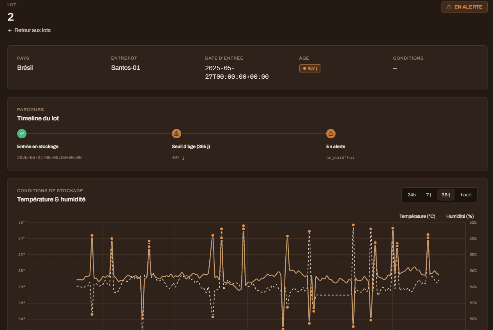
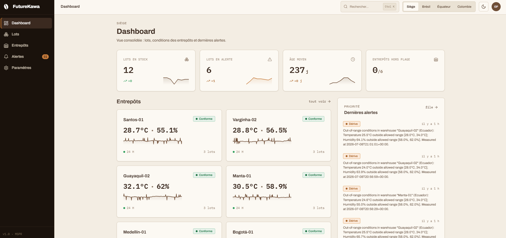

# 🔄 Conduite du changement — superviser le café vert dans trois pays

> 🌐 **Langues :** [English](../en/change-management.md) · **Français** · [Português](../pt/gestao-da-mudanca.md) · [Español](../es/gestion-del-cambio.md)

Ce plan décrit comment FutureKawa passe d'un suivi de stockage **semi-manuel et
difficile à auditer** à une **plateforme supervisée et multi-pays** — et surtout
**comment les équipes de terrain l'adoptent**. Toute la démarche repose sur un
principe : le changement se fait **sur site et dans la langue locale** (🇧🇷 portugais
pour le Brésil, 🇪🇨🇨🇴 espagnol pour l'Équateur et la Colombie), jamais comme une
consigne poussée à distance depuis le siège.

Ce document complète le [guide utilisateur](../../user-guide/fr/index.md) (comment
utiliser l'application) et le [schéma d'automatisation de la phase 2](../../phase2/automation-schema.md)
(vers où va ce changement).

## Table des matières

- [🎯 Contexte & objectif du changement](#-contexte--objectif-du-changement)
- [👥 Parties prenantes & impact](#-parties-prenantes--impact)
- [🧭 Démarche d'adoption — les trois piliers](#-démarche-dadoption--les-trois-piliers)
- [🗺️ Déploiement par phases](#-déploiement-par-phases)
- [🎓 Plan de formation](#-plan-de-formation)
- [📣 Plan de communication](#-plan-de-communication)
- [🧱 Gestion des résistances](#-gestion-des-résistances)
- [🛟 Modèle de support](#-modèle-de-support)
- [📊 Indicateurs de réussite (KPI)](#-indicateurs-de-réussite-kpi)
- [🔮 Lien avec la phase 2](#-lien-avec-la-phase-2)
- [🔗 Documents liés](#-documents-liés)

## 🎯 Contexte & objectif du changement

Aujourd'hui, les conditions de stockage du café vert sont suivies de façon
**semi-manuelle** : relevés notés à la main ou dans des tableurs dispersés, rotation
**FIFO** appliquée de mémoire, et aucune piste d'audit fiable quand un client réclame
une **preuve de traçabilité**. Quand la température ou l'humidité dérive, personne ne
le sait avant que les grains aient déjà perdu leur arôme ou soient déclassés — la perte
est constatée **après** les dégâts.

Le changement introduit une **plateforme supervisée** unique : les capteurs publient
la température/humidité automatiquement, les lots sont suivis du plus ancien au plus
récent, les **alertes** se déclenchent dès que les conditions sortent de la plage
idéale, et le siège consolide les trois pays dans une vue unique — tout en laissant
**chaque pays maître de ses données** (souveraineté).

| | Avant — semi-manuel | Après — plateforme supervisée |
|---|---|---|
| 🌡️ Conditions | Relevées à la main, par intermittence | Mesurées automatiquement, en continu |
| 🔁 Rotation FIFO | De mémoire, source d'erreurs | Liste du plus ancien, toujours visible |
| 🚨 Dérive | Constatée après les dégâts | Alerte à l'instant où elle survient |
| 🧾 Traçabilité | Difficile à reconstituer | Historique enregistré par lot |
| 🌍 Vue multi-pays | Aucune | Consolidée au siège, données locales |

> 💡 **Pourquoi c'est important pour le terrain.** Il ne s'agit pas de « plus d'écrans
> à remplir ». Cela supprime la prise de notes manuelle, remplace les approximations de
> rotation par une liste claire, et fait qu'un responsable d'entrepôt est **prévenu à
> temps** pour sauver un lot au lieu d'expliquer une perte après coup. L'objectif de la
> conduite du changement est de **faire ressentir** ce bénéfice, pas seulement de
> l'annoncer.



## 👥 Parties prenantes & impact

Toutes les personnes touchées par la plateforme, ce qui change pour elles, et le
bénéfice concret qui emporte leur adhésion. Les niveaux de support **N1**
(correspondant SI local) et **N2** (infra/DevOps) sont décrits dans le
[modèle de support](#-modèle-de-support).

| Rôle | 🔧 Impact (ce qui change) | 🎁 Bénéfice (ce qu'ils y gagnent) |
|---|---|---|
| 🏭 **Responsable d'exploitation** | Reçoit les alertes de stockage par e-mail ; agit sur la dérive et l'âge des lots. | Moins de pertes ; réagit à temps au lieu d'expliquer les dégâts. |
| 📦 **Responsable d'entrepôt** | Utilise la liste FIFO des lots et les courbes au quotidien, au lieu de notes manuelles. | Ordre de rotation clair ; conditions visibles d'un coup d'œil. |
| 🔬 **Responsable qualité** | Consulte l'historique enregistré pour certifier les conditions d'un lot. | Vraie preuve de traçabilité pour les clients et les audits. |
| 🚚 **Responsable supply-chain** | Planifie les expéditions sur des données de stock consolidées et fiables. | Moins de surprises ; expédie d'abord les bons lots. |
| 🏢 **Superviseur au siège** | Obtient une vue multi-pays unique et consolidée. | Pilote trois pays depuis un tableau de bord ; repère les tendances. |
| 🧑‍💻 **Correspondant SI local (N1)** | Devient le premier point de contact et le relais sur site. | Rôle local reconnu ; lien direct avec le N2. |
| ⚙️ **Infra / DevOps (N2)** | Exploite et surveille les stacks par pays et du siège. | Déploiements reproductibles ; une stack par pays, pilotée par variables. |

> 📸 **[SCREENSHOT]** — E-mail d'alerte reçu par le responsable d'exploitation :
> entrepôt, identifiant de lot, valeur de température/humidité hors plage, horodatage.

## 🧭 Démarche d'adoption — les trois piliers

L'adoption repose sur les trois piliers de la MSPR. Aucun ne fonctionne seul : la
**participation** crée la confiance, la **communication** tient tout le monde informé,
la **formation** construit la compétence — le tout **sur site, dans la langue locale**.

| Pilier | Ce que cela signifie ici | Comment nous le mettons en œuvre |
|---|---|---|
| 🤝 **Participation** | Le terrain façonne le déploiement, ne fait pas que le subir. | Ateliers sur site par pays ; utilisateurs-clés locaux choisis tôt ; les retours guident les correctifs. |
| 📣 **Communication** | Chacun connaît le pourquoi, le quand et où trouver de l'aide. | Lancement en langue locale, points réguliers, boucle de retour bidirectionnelle (voir plus bas). |
| 🎓 **Formation** | Chaque rôle sait faire son travail quotidien dans l'outil, en confiance. | Sessions par rôle, pratiques, **sur site et en PT / ES** ; formation de formateurs. |

> 💡 Les trois piliers sont **répétés dans la langue locale dans chaque pays**, par un
> formateur local quand c'est possible. Un message qui passe en portugais dans un
> entrepôt brésilien vaut plus qu'un support parfait en anglais.

## 🗺️ Déploiement par phases

Nous n'activons **pas** les trois pays d'un coup. Nous **pilotons sur un pays**,
prouvons la valeur, puis **généralisons** aux deux autres — en emportant les
enseignements.

| Phase | Périmètre | Objectif | Sortie → phase suivante |
|---|---|---|---|
| 0️⃣ **Préparer** | Siège + pays pilote | Stacks déployées, utilisateurs-clés désignés, supports traduits. | Environnement prêt, formateurs prêts. |
| 1️⃣ **Piloter** | 🇧🇷 Brésil (1–2 entrepôts) | Usage réel sur lots réels ; recueil des frictions ; réglage seuils/alertes. | **Go/no-go** atteint (ci-dessous). |
| 2️⃣ **Généraliser** | 🇪🇨 Équateur + 🇨🇴 Colombie | Rejouer le mode opératoire éprouvé, en ES, sur site. | Même go/no-go par pays. |
| 3️⃣ **Exploiter & améliorer** | Les 3 pays | Support de régime, revue des KPI, préparation phase 2. | KPI stables ; entretien phase 2 lancé. |

Le Brésil est le pilote naturel : plus grosse exploitation et référence pour les seuils
de stockage. Ajouter un pays revient à **rejouer la même stack**, configurée uniquement
par variables d'environnement — voir [Faire tourner la stack](../../deployment/running-the-stack.md).

### ✅ Critères go / no-go

Avant de généraliser au-delà du pilote, **tous** ces critères doivent être remplis :

| Critère | 🎯 Cible |
|---|---|
| 📈 Adoption | Les utilisateurs-clés se connectent et utilisent la liste FIFO **chaque jour** pendant 2 semaines. |
| 🚨 Alertes crédibles | Les alertes donnent lieu à une action, et les **fausses alertes** restent sous un taux bas convenu. |
| 📥 Complétude des données | Des mesures arrivent de chaque entrepôt pilote, peu de trous. |
| 🧑‍🏫 Capacité locale | Au moins **un formateur local formé** par site pilote. |
| 😀 Satisfaction | Les utilisateurs pilotes déclarent que l'outil **fait gagner du temps** vs. le manuel. |

> ⚠️ Un **no-go** n'est pas un échec : il met en pause la généralisation jusqu'à ce que
> le critère bloquant soit corrigé (ex. trop de fausses alertes → réajuster les
> tolérances avant déploiement).

## 🎓 Plan de formation

La formation est **sur site et en langue locale** — c'est le cœur du plan. Aucun rôle
n'est formé via un webinaire générique en anglais ; un formateur est **dans
l'entrepôt**, parlant **portugais au Brésil** et **espagnol en Équateur et en
Colombie**.

### Sessions par rôle

| Rôle | Langue | Format | Contenu |
|---|---|---|---|
| 🏭 Responsable d'exploitation | PT / ES | Sur site, ~½ journée | Lire les alertes, agir sur dérive & âge des lots, escalade. |
| 📦 Responsable d'entrepôt | PT / ES | Sur site, pratique | Liste FIFO, ouvrir un lot, lire les courbes au quotidien. |
| 🔬 Responsable qualité | PT / ES | Sur site, ~½ journée | Historique & traçabilité, export de preuve pour les clients. |
| 🚚 Responsable supply-chain | PT / ES | Sur site / à distance | Vue de stock consolidée, planifier sur données fiables. |
| 🏢 Superviseur au siège | EN / local | À distance + sur site | Tableau de bord multi-pays, tendances inter-pays. |
| 🧑‍💻 Correspondant N1 | Locale | Approfondi, sur site | Tout ce qui précède + dépannage de 1er niveau + quand escalader au N2. |

### Supports & formation de formateurs

| Élément | Langue | Notes |
|---|---|---|
| 🧑‍🏫 **Formation de formateurs** | PT / ES | Le siège forme d'abord les formateurs locaux ; ils forment ensuite dans le pays. |
| 📘 **Guide de prise en main** | PT / ES | Court, illustré de captures ; reflète le [guide utilisateur](../../user-guide/fr/index.md). |
| 🎬 **Tutoriels enregistrés à l'écran** | PT / ES | Liste FIFO, lecture d'une courbe, réaction à une alerte. |
| 🃏 **Aide-mémoire d'une page** | PT / ES | Affiché dans l'entrepôt ; seuils + « que faire sur une alerte ». |
| ❓ **FAQ** | PT / ES | Miroir local de la [FAQ](../../user-guide/fr/faq.md) du guide. |

> 💡 La **formation de formateurs** est ce qui permet à une formation sur site en langue
> locale de passer à l'échelle des trois pays : le siège forme une poignée de formateurs
> locaux, et **ce sont eux** qui animent les sessions en entrepôt en PT / ES — le savoir
> reste local, et le support aussi.

> 📸 **[SCREENSHOT]** — Page de couverture du guide de prise en main, localisé en
> portugais, montrant la liste FIFO des lots d'un entrepôt brésilien.

## 📣 Plan de communication

Clair, répété, **bidirectionnel**, et toujours disponible en langue locale.

| Canal | Public | Cadence | Objectif |
|---|---|---|---|
| 🚀 **Réunion de lancement (sur site)** | Tous les rôles par pays | Une fois, au début de phase | Expliquer le pourquoi, le plan, et à qui demander de l'aide. |
| 🗞️ **Point d'avancement** | Toutes les parties prenantes | Hebdomadaire pendant le déploiement | Ce qui a été livré, la suite, les réussites du pilote. |
| 🧑‍🤝‍🧑 **Point rapide local** | Entrepôt + N1 | Quotidien pendant le pilote | Faire remonter vite les frictions ; rien n'attend une semaine. |
| 📧 **E-mails d'alerte** | Responsables d'exploitation | Événementiel | Le signal opérationnel lui-même (dérive / âge de lot). |
| 🗣️ **Canal de retour** | Tout le monde | Toujours ouvert | Recueillir problèmes & idées ; boucler la boucle. |

### 🔑 Messages clés

- **« Ça sauve vos lots. »** La plateforme vous prévient **à temps** pour agir, pas après.
- **« Vos données restent dans votre pays. »** Le siège consolide une vue ; il ne prend jamais votre base.
- **« Ça remplace les notes manuelles »**, ça n'ajoute pas de paperasse par-dessus.
- **« L'aide est locale. »** Votre premier contact est votre correspondant N1 sur site.

### 🔁 Boucle de retour

Chaque objection, bug ou idée va au **correspondant N1** local, est triée avec le **N2**
si c'est technique, et le résultat est **restitué** à la personne qui l'a soulevée. Un
suivi visible est ce qui transforme la communication en confiance.

## 🧱 Gestion des résistances

Les objections sont attendues et légitimes. Nous les nommons et y répondons **avant**
qu'elles ne se durcissent — en langue locale, sur site.

| 🗣️ Objection attendue | ✅ Comment nous y répondons |
|---|---|
| « Le manuel marchait très bien. » | Montrer côte à côte : une alerte qui rattrape une dérive que le manuel aurait manquée. |
| « C'est du travail en plus. » | Démontrer que cela **supprime** les notes manuelles ; le geste quotidien est un coup d'œil, pas une saisie. |
| « Trop de fausses alertes, je vais les ignorer. » | Régler les tolérances pendant le pilote ; un faible taux de fausses alertes est un critère **go/no-go**. |
| « Je ne fais pas confiance aux chiffres du capteur. » | Recouper les relevés sur site pendant la formation ; expliquer la plage idéale & la tolérance. |
| « En anglais je ne comprends pas tout. » | **Tout** est délivré en PT / ES, sur site, par un formateur local. |
| « Le siège nous surveille / prend nos données ? » | Expliquer la souveraineté : le pays possède sa base ; le siège n'interroge qu'une vue consolidée. |
| « Qui j'appelle quand ça casse ? » | Un correspondant **N1 local** nommé, avec le N2 derrière — imprimé sur l'aide-mémoire. |

> 💡 Le meilleur antidote à la résistance est un **champion local** : un collègue
> d'entrepôt respecté, formé en premier, qui répond dans la langue locale et prouve
> l'outil sur les propres lots de l'équipe.

## 🛟 Modèle de support

Deux niveaux, alignés sur le contexte client — **le local d'abord**, l'infra derrière.

| Niveau | Qui | Périmètre | Fait appel à |
|---|---|---|---|
| 🧑‍💻 **N1 — correspondant SI local** | Sur site, par pays, parle la langue locale | Premier contact : questions d'usage, « cette alerte est-elle réelle ? », vérifications de base, tri. | Escalade les soucis infra/plateforme au N2. |
| ⚙️ **N2 — infra / DevOps** | Central, inter-pays | Plateforme : stacks, broker, API, déploiements, incidents, flux de données. | Propriétaire du [système distribué](../../architecture/distributed-system.md) & des déploiements. |

```
Utilisateur  ──▶  N1 (local, sur site, PT/ES)  ──▶  N2 (infra / DevOps, central)
   ▲                     │                              │
   └──────— réponse ◀─────┴──— correctif plateforme ◀────┘
```

> 💡 La plupart des questions du quotidien sont des questions **d'usage** et s'arrêtent
> au **N1** — en langue locale, sur site. Seules les vraies pannes de plateforme
> remontent au N2. Le support reste rapide, local et compréhensible.

## 📊 Indicateurs de réussite (KPI)

Comment savoir que le changement a réellement pris — revus par pays et au siège.

| KPI | 📐 Ce qu'il mesure | 🎯 Sens |
|---|---|---|
| 📈 **Taux d'adoption** | Utilisateurs actifs vs. attendus, et usage quotidien de la liste FIFO. | ⬆️ Vers un usage stable, quasi total. |
| ⏱️ **Temps de réaction aux alertes** | Délai entre alerte déclenchée → action menée. | ⬇️ En baisse — réagir avant les dégâts. |
| 📉 **Réduction des pertes** | Lots déclassés/perdus vs. la base manuelle. | ⬇️ En baisse — le gain métier central. |
| 📥 **Complétude des données** | Part des mesures attendues effectivement reçues. | ⬆️ En hausse — peu de trous par entrepôt. |
| 😀 **Satisfaction utilisateurs** | Le terrain déclare gagner du temps & faire confiance aux alertes. | ⬆️ En hausse — adhésion durable. |
| 🧑‍🏫 **Autonomie locale** | Questions résolues au N1 sans escalade. | ⬆️ En hausse — le support local fonctionne. |

> 💡 Les KPI sont revus **avec** les équipes locales, dans leur langue — la revue est
> elle-même un moment de communication et de participation, pas un audit.



## 🔮 Lien avec la phase 2

La phase 1 fait **confier la supervision aux gens** : ils apprennent à s'appuyer sur les
alertes, à agir sur la dérive et à lire les courbes. La phase 2 **ferme la boucle** —
les mêmes mesures pilotent des **actionneurs** (chauffage, aération, humidification) qui
maintiennent chaque entrepôt dans sa plage idéale **automatiquement** (voir le
[schéma d'automatisation](../../phase2/automation-schema.md)).

Cette automatisation ne sera acceptée que si la **phase humaine a eu lieu d'abord** :

| Habitude de changement (phase 1) | Prépare l'acceptation en phase 2 de… |
|---|---|
| Faire confiance aux alertes & à la plage idéale | Faire confiance au contrôleur qui agit sur la même plage. |
| Réagir à la dérive à la main | Laisser les actionneurs réagir, avec un **contrôle manuel** conservé. |
| Consulter l'historique enregistré | Revoir la piste d'audit des commandes automatiques. |
| Support N1 local + N2 central | Les mêmes niveaux de support exploitant la boucle de contrôle. |

> 💡 Une équipe qui fait déjà confiance aux alertes acceptera un actionneur qui agit sur
> ces mêmes alertes. La conduite du changement en phase 1 est ce qui rend
> l'automatisation de la phase 2 **bienvenue** au lieu d'imposée. Les décisions ouvertes
> sont réunies dans le [questionnaire d'entretien](../../phase2/interview-questionnaire.md).

## 🔗 Documents liés

- [Guide utilisateur](../../user-guide/fr/index.md) — comment le terrain utilise l'application au quotidien.
- [Phase 2 — schéma d'automatisation](../../phase2/automation-schema.md) — vers où va ce changement.
- [Phase 2 — questionnaire d'entretien](../../phase2/interview-questionnaire.md) — décisions encore ouvertes.
- [Système distribué](../../architecture/distributed-system.md) — la topologie multi-pays souveraine.
- [Faire tourner la stack](../../deployment/running-the-stack.md) — déployer une stack par pays.
