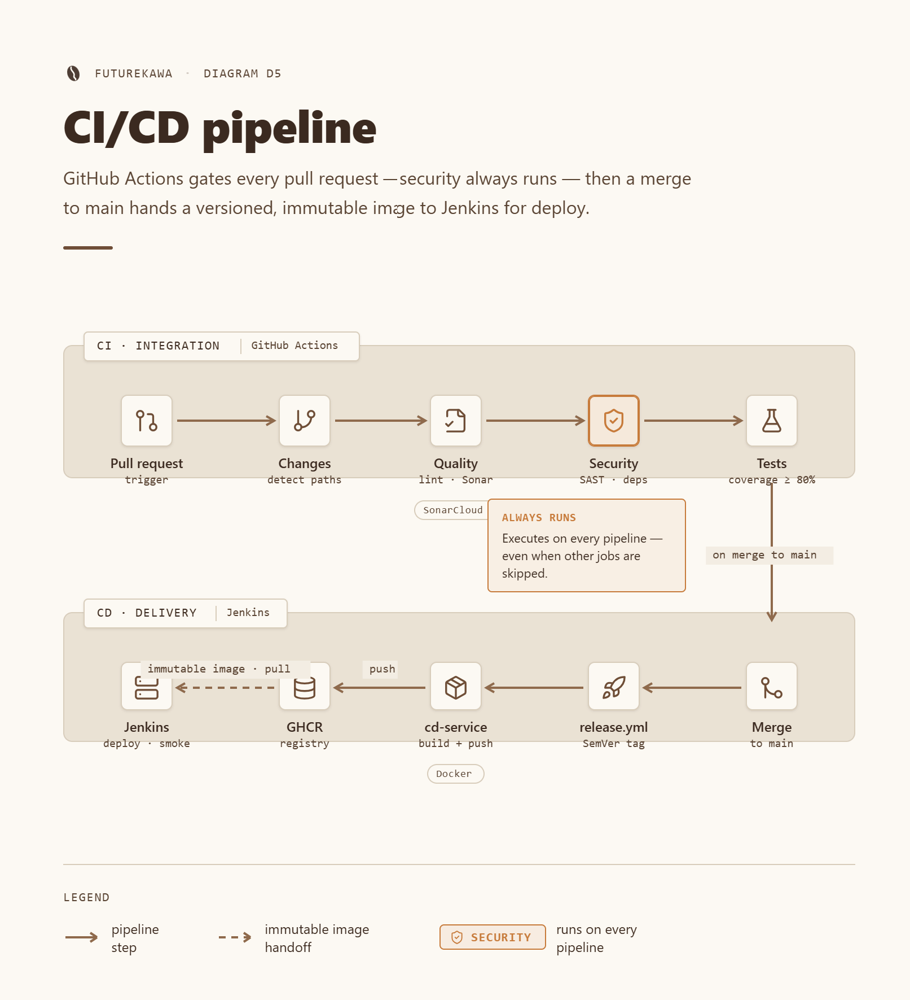
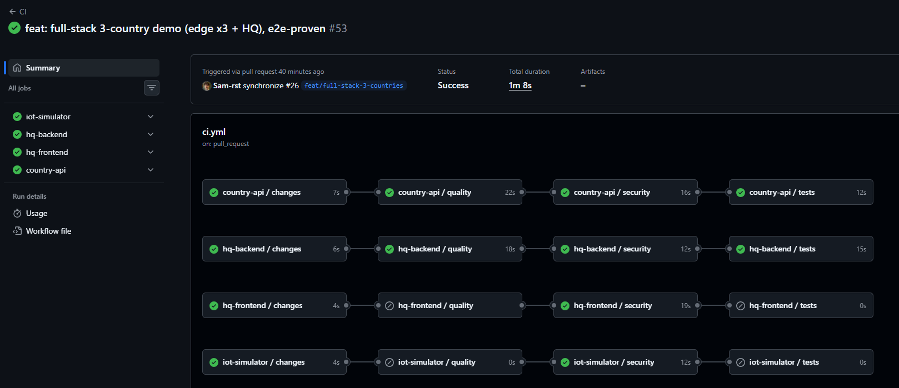
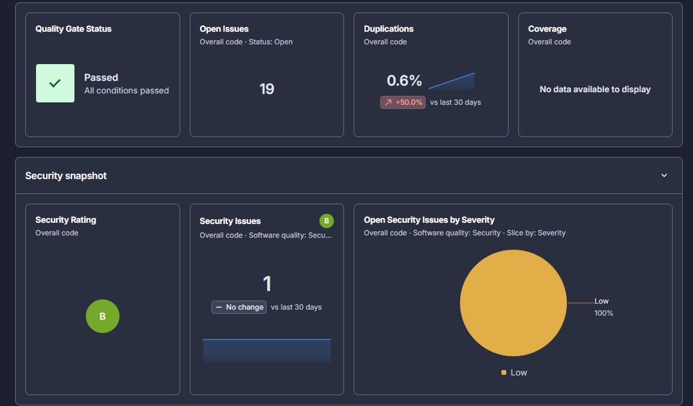

# 🔀 CI/CD pipeline

FutureKawa runs its CI/CD on **GitHub Actions**, publishing immutable images to
the **GitHub Container Registry (GHCR)**. Every service follows the **same
pipeline shape**, so the whole team shares one mental model. This document is
livrable 5. Deployment to the VPS is handled by Jenkins, justified in
[ADR-001](./adr-001-ci-cd-hybrid.md).



## Table of contents

- [Principles](#principles)
- [Workflows at a glance](#workflows-at-a-glance)
- [CI — the job chain](#ci--the-job-chain)
- [Gating rules](#gating-rules)
- [Quality gates: coverage & SonarCloud](#quality-gates-coverage--sonarcloud)
- [Release — build, push & versioning](#release--build-push--versioning)
- [Security hardening](#security-hardening)
- [Running the pipeline locally](#running-the-pipeline-locally)
- [Adding a service](#adding-a-service)

## 🎛️ Principles

- 💸 **Cheap** — CI runs on **pull requests only** (no push trigger) and skips work
  for services whose code didn't change.
- 🧩 **Uniform** — one reusable workflow per service, all with identical gating.
- 🔒 **Safe by default** — the CVE audit runs on **every** PR, even when nothing
  else does; all actions are pinned to commit SHAs.
- 🏷️ **Traceable** — every image carries an immutable `:sha-<commit>` tag; releases
  are versioned per service.

## 🗂️ Workflows at a glance

| File | Trigger | Role |
|---|---|---|
| `ci.yml` | `pull_request` | 🎯 **CI orchestrator** — calls each service's reusable CI |
| `ci-<service>.yml` | `workflow_call` | ♻️ **Per-service CI** — the job chain below |
| `release.yml` | `pull_request` `closed` (merged to `main`) | 🏷️ **Release orchestrator** — derives the version bump + calls each changed service's build/push |
| `cd-<service>.yml` | `workflow_call` | 📦 **Per-service build & push** to GHCR |

Services wired today: `iot-simulator`, `hq-backend`, `hq-frontend`, `country-api`
— each with a matching `ci-*.yml` and `cd-*.yml`.

## ⛓️ CI — the job chain

`ci.yml` fans out to every service on each PR. The four jobs of a service pipeline
run **sequentially**, each depending on the previous:

```
changes ──► quality ──► security ──► tests
```

| Job | Runs when | Does |
|---|---|---|
| `changes` | always (first) | detects whether the service **code** changed (`dorny/paths-filter`) |
| `quality` | code changed | lint · format · typecheck · build |
| `security` | quality passed **or was skipped** | dependency **CVE audit** |
| `tests` | code changed **and** quality + security passed | tests + **80 % coverage gate** |

Per-service commands:

| Service | Quality | Security | Tests + coverage |
|---|---|---|---|
| `iot-simulator` | `uv run poe quality` (ruff · mypy · vulture) | `uv run poe security` (pip-audit) | `uv run poe test` (`--cov-fail-under=80`) |
| `hq-backend` | oxlint · oxfmt · tsc · build | `npm audit --omit=dev --audit-level=high` | `npm run test:coverage` (80 % thresholds) |
| `hq-frontend` | oxlint · oxfmt · tsc · vite build | `npm audit --omit=dev --audit-level=high` | `npm run test:coverage` (80 % on `src/lib`) |
| `country-api` | `composer quality` (lint:yaml · lint:container · php-cs-fixer · phpstan) | `composer audit` | `composer test:coverage` |



## 🚦 Gating rules

The gating is **identical** across services and matters for both cost and safety:

- **`quality` / `tests` are skippable** — `if: needs.changes.outputs.code == 'true'`.
  No code change ⇒ they are skipped, saving runner minutes.
- **`security` always runs** — `if: ${{ !failure() && !cancelled() }}`. This is
  deliberate: a PR that only touches docs must still get its dependency **CVE
  audit**, so a new advisory never slips through.

### Why `!failure() && !cancelled()` and not `result == 'skipped'`

The `security` job `needs: quality`, but we want it to run **even when `quality`
was skipped** (no code change) — while still **not** running when `quality`
actually **failed**. The intuitive condition does not work:

```yaml
# ❌ never runs — see why below
if: ${{ needs.quality.result == 'skipped' }}
```

GitHub prepends an implicit `success()` to any `if` you write. `success()` returns
`false` the moment a dependency was skipped, so the job is skipped before your
expression is even considered. Only the **status functions** lift that implicit
check:

```yaml
# ✅ runs on success OR skipped; stops only on real failure/cancel
if: ${{ !failure() && !cancelled() }}
```

This keeps the CVE audit on **every** PR. The `tests` job, by contrast, must only
run on a genuinely healthy build, so it uses explicit success checks:
`needs.quality.result == 'success' && needs.security.result == 'success'`.

## 📊 Quality gates: coverage & SonarCloud

Two independent gates must both be green to merge:

| Gate | Enforced by | Blocks merge? |
|---|---|---|
| **80 % coverage** | the `tests` job of each service (thresholds in `vitest.config.ts` / `pyproject.toml`) | ✅ yes |
| **SonarCloud Quality Gate** | SonarCloud auto-analysis (GitHub App) on every PR | ✅ yes |

- **Coverage** — enforced by the runner: Vitest fails under its `thresholds`,
  pytest under `--cov-fail-under=80`. The country API emits Clover `coverage.xml`
  (failing-threshold alignment is a tracked follow-up). Details in the
  [test strategy](../tests/strategy.md#the-80-coverage-gate).
- **SonarCloud** — analysis is scoped by `sonar-project.properties` (excludes
  `node_modules`, `dist`, `coverage`, generated files; marks `*.test.*`/`*.spec.*`
  as tests). It reports coverage, duplication, code smells, and **security rules**
  (see [Security hardening](#security-hardening)); a failing Quality Gate is a
  **required status check**, so the PR cannot merge.



## 🏷️ Release — build, push & versioning

On merge to `main`, `release.yml` derives the version bump from the **source
branch name** (read from the PR event, so it works with squash-merges) and
builds/pushes only the services with image-relevant changes (`src`, deps,
`Dockerfile`). Each changed service calls its reusable `cd-<service>.yml`, which:

1. checks out `main` with full tag history,
2. computes the next SemVer from the latest `<service>-vX.Y.Z` git tag,
3. creates + pushes the version tag (when the bump is a real release),
4. logs in to GHCR with the built-in `GITHUB_TOKEN`,
5. builds and pushes the image with `latest`, `sha-<commit>`, and the version tag.

### SemVer from the branch name

| Branch prefix | Bump | Image tags pushed |
|---|---|---|
| `feat/` · `feature/` | **minor** (`1.2.0` → `1.3.0`) | `:1.3.0` + `:sha-xxxxxxx` + `:latest` |
| `fix/` | **patch** (`1.2.0` → `1.2.1`) | `:1.2.1` + `:sha-xxxxxxx` + `:latest` |
| anything else (`docs/`, `ci/`, `chore/`…) | **none** | `:sha-xxxxxxx` + `:latest` |
| **major** | **manual** — create `<service>-vX.0.0` by hand; automation continues from it | |

- **Registry:** `ghcr.io/epsi-teamsyct/futurekawa-<service>`, authenticated with
  the built-in `GITHUB_TOKEN` — **no secret to configure**.
- **Per service versioning:** each keeps its own line via git tags
  `<service>-vX.Y.Z`, so a backend patch never bumps the frontend.
- **Immutability & traceability:** the `:sha-<commit>` tag ties every image to its
  exact commit; Jenkins deploys that exact digest ([ADR-001](./adr-001-ci-cd-hybrid.md)).

## 🛡️ Security hardening

- 📌 **Actions pinned to full commit SHAs** — never floating `@v4` tags — so a
  compromised tag cannot silently change what runs. Examples in use:

  | Action | Pin |
  |---|---|
  | `actions/checkout` | `@34e114876…` `# v4` |
  | `dorny/paths-filter` | `@d1c1ffe02…` `# v3` |
  | `actions/setup-node` | `@49933ea52…` `# v4` |
  | `shivammathur/setup-php` | `@f3e473d11…` `# v2` |
  | `astral-sh/setup-uv` | `@d4b2f3b6e…` `# v5` |
  | `docker/build-push-action` | `@10e90e364…` `# v6` |

- 🛡️ **No shell injection** — attacker-controllable values (e.g.
  `github.head_ref`, the branch name) are passed as **environment variables**,
  never interpolated into a `run:` script.
- 🔐 **Least privilege** — CI needs no write scopes; only `cd-*.yml` requests
  `contents: write` (tag) + `packages: write` (push).
- 🔎 **SonarCloud** auto-analysis gates the merge (rules for hardcoded secrets,
  Docker non-root, explicit COPY — see [security/auth.md](../security/auth.md)).
- 🐳 **Hardened images** — non-root users, explicit `COPY`, prod-only dependencies;
  documented in [security/auth.md](../security/auth.md#image-hardening).

## 💻 Running the pipeline locally

The CI commands **are** the local commands — no surprises:

```bash
# iot-simulator (uv + poethepoet)
cd apps/country/iot/simulator && uv run poe ci      # quality + security + test

# hq-backend / hq-frontend (npm)
cd apps/hq/backend   # or apps/hq/frontend
npm run lint && npm run format:check && npm run typecheck && npm run build
npm audit --omit=dev --audit-level=high
npm run test:coverage

# country-api (composer)
cd apps/country/api && APP_ENV=test APP_SECRET=ci composer ci   # quality + security + test:coverage
```

See [manual tests](../tests/manual-tests.md) for the per-service detail.

## ➕ Adding a service

1. **CI:** copy `ci-<existing>.yml` → `ci-<service>.yml`, adapt the path filter +
   commands (keep the gating verbatim), add a job in `ci.yml`.
2. **CD:** copy `cd-<existing>.yml` → `cd-<service>.yml`, adapt `SERVICE` / `IMAGE`
   / `CONTEXT`, add a `paths-filter` entry + a job in `release.yml`.

> ⚠️ `pull_request`-triggered workflows only take effect once they live on `main`
> (GitHub runs them from the base branch).
