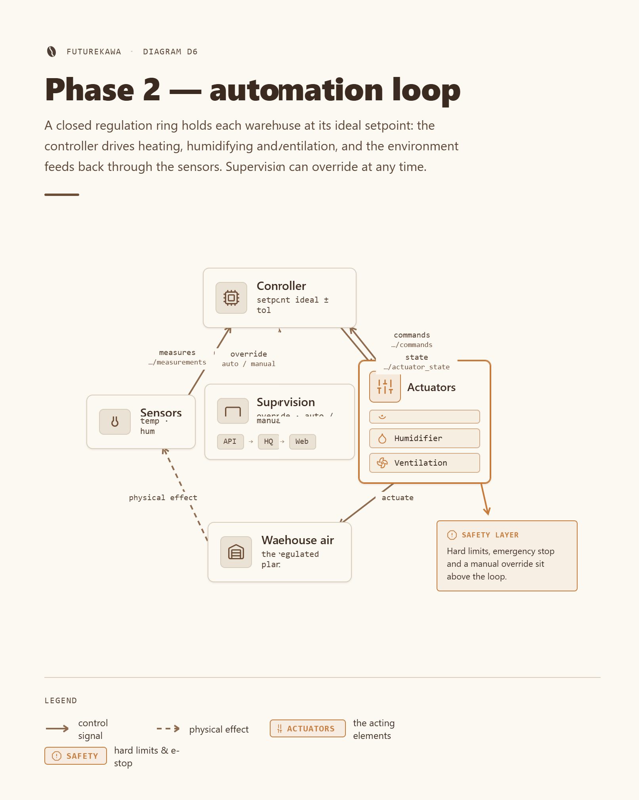

# 🤖 Phase 2 — automation schema

Principle schema for the **future** warehouse automation (phase 2). Today
FutureKawa only **observes** storage conditions: sensors publish measurements, the
backend raises alerts, and a human reacts. Phase 2 **closes the loop** — the same
measurements drive **actuators** (heating, aeration, humidification) that keep each
warehouse inside its ideal band **without manual intervention**.

This document describes the **principle only**. It is a design input for the
phase‑2 client interview (see the
[interview questionnaire](interview-questionnaire.md)), not a committed
implementation. Nothing here changes the phase‑1 code.

## Table of contents

- [Principle diagram](#principle-diagram)
- [The control loop](#the-control-loop)
- [Actuators vs. triggering condition](#actuators-vs-triggering-condition)
- [Nominal case](#nominal-case)
- [Degraded case](#degraded-case)
- [Safety mechanisms](#safety-mechanisms)
- [Integration with the existing IoT layer](#integration-with-the-existing-iot-layer)
- [Open points for the client](#open-points-for-the-client)
- [Related docs](#related-docs)

## Principle diagram



The loop is deliberately the **same shape** as phase 1, with a decision unit and
actuators added inside the warehouse:

```
   +---------------------- WAREHOUSE (per site) -----------------------+
   |                                                                   |
   |  +-----------+   measure   +----------------+  command  +-------+  |
   |  | ESP8266 + | ----------> |  CONTROLLER     | -------> |  ACTU  |  |
   |  |  DHT11    |   (MQTT)    | (decision unit) |          | -ATORS |  |
   |  +-----------+             | setpoint =      | <------- | heat / |  |
   |       ^                    | ideal +/- tol.  |  state   | aerate |  |
   |       | air condition      | + hysteresis    |          | humid. |  |
   |       +--------------------+--------+--------+           +---+---+  |
   |                    physical effect on the air ------------+        |
   +------------------------------------+------------------------------+
                                        | MQTT
                                        v
              +--------------------------------------------+
              |  Country API  ->  HQ backend  ->  Web app   |
              |  (alerts . history . supervision . override) |
              +--------------------------------------------+
```

> 💡 The **sensors → processing/decision → actuators** chain is a closed loop:
> the actuators change the air, the sensors measure the change, and the controller
> corrects again — until the reading sits inside the target band.

## The control loop

| Stage | Role | Component |
|---|---|---|
| 📡 **Sensors** | Publish temperature/humidity every 30 s over MQTT (unchanged from phase 1). | ESP8266 + DHT11 (or the Python simulator). |
| 🧠 **Processing / decision** | Compare each reading to the **country setpoint** (ideal ± tolerance) and decide which actuator to drive. A **hysteresis deadband** prevents rapid on/off cycling. | Controller / decision unit (on‑site edge or country service). |
| ⚙️ **Actuators** | Act on the air (heat, aerate, humidify) to push the reading back into the band. | Heating / ventilation / humidification elements. |
| 🖥️ **Supervision** | Keeps the phase‑1 observability role and gains a **manual override** channel. | Country API → HQ backend → web app. |

Temperature and humidity are **coupled** (aeration lowers both), so the controller
resolves conflicts with a fixed priority: **safety first, then temperature, then
humidity**.

## Actuators vs. triggering condition

Each country has an ideal value and a tolerance; the setpoint band is
`ideal ± tolerance`, with an inner **hysteresis deadband** so an actuator only
switches when the reading has clearly crossed the edge.

| Actuator | 🎯 Purpose | ✅ Triggering condition | 🛑 Stops when |
|---|---|---|---|
| 🔥 **Heating** | Raise air temperature | `temperature < ideal − tolerance` | `temperature ≥ ideal − deadband` |
| 💨 **Aeration / ventilation** | Exchange air to cool and/or dry | `temperature > ideal + tolerance` **or** `humidity > ideal + tolerance` | reading back inside the band |
| 💧 **Humidification** | Add moisture to the air | `humidity < ideal − tolerance` | `humidity ≥ ideal − deadband` |
| ⏸️ **All idle (hold)** | Preserve energy & equipment | reading **inside** the band (± deadband) | a value crosses a band edge |

The ideal bands are the **phase‑1 thresholds**, reused verbatim:

| Country | Temp ideal (°C) | Humidity ideal (%) | Tolerance |
|---|---|---|---|
| 🇧🇷 Brazil | 29 | 55 | ± 3 °C / ± 2 % |
| 🇪🇨 Ecuador | 31 | 60 | ± 3 °C / ± 2 % |
| 🇨🇴 Colombia | 26 | 80 | ± 3 °C / ± 2 % |

## Nominal case

Sensor data is fresh and the actuators are healthy:

1. The controller reads a fresh measurement from the measurements topic.
2. It compares the reading to the country setpoint (± tolerance, minus deadband).
3. It drives at most the actuators from the table above and publishes their state.
4. The air changes, the next measurement moves back toward the band, and the loop
   settles with **all actuators idle** once inside the band.
5. The web app shows the warehouse in **auto** mode, in band, no active alert.

> 📸 **[SCREENSHOT]** — HQ dashboard, Brazil selected, warehouse wh-01 open in
> phase‑2 "auto" mode: temperature/humidity curve inside the green band, actuator
> panel showing all elements idle, no active alert.

## Degraded case

The loop must **fail safe** — it never trusts a stale reading or a silent
actuator, and it never crosses a hard limit.

| Situation | Detection | Behaviour |
|---|---|---|
| 🕓 **Stale sensor data** | No measurement for N cycles (watchdog timeout). | Hold the last safe state, then **stop all actuators** and raise an alert. |
| 🧰 **Actuator fault** | Command sent, no expected effect on the reading. | Disable the faulty actuator, alert, fall back to **manual**. |
| 🔌 **Broker / API down** | MQTT link lost (last‑will fires). | Controller runs **autonomously** on its local setpoint; supervision catches up on reconnect. |
| 🌡️ **Out‑of‑range persists** | In‑band target unreachable (e.g. heatwave). | Keep correcting toward the band and **escalate the alert**; never exceed a hard limit. |
| ⚡ **Power cut / restart** | Cold start. | Boot into the **configured safe default** (typically all actuators off) until a fresh reading is validated. |

> ⚠️ Coffee tolerates a short excursion far better than a **stuck heater** or a
> **jammed vent**. When in doubt, the safe state is **actuators off**, not
> actuators on.

## Safety mechanisms

- 🎚️ **Setpoints & hysteresis** — soft setpoint = ideal ± tolerance; a hysteresis
  **deadband** inside the band stops on/off chatter and protects the equipment
  (minimum on/off durations back this up).
- 🚧 **Hard limits** — absolute min/max beyond which an actuator is **force‑stopped**
  regardless of the loop, so a control bug can never cook or soak a lot.
- 🛑 **Logical emergency stop** — a single command (local button **and/or**
  supervision) that idles every actuator into the safe state at once.
- 🔁 **Manual / auto / off modes** — every warehouse runs in **auto** (closed loop),
  **manual** (operator drives the actuators), or **off**. Manual and the emergency
  stop **always win** over auto.
- 🐕 **Watchdog & timeouts** — stale sensor data or a stuck actuator trips a timeout
  that returns the site to the safe state and alerts.
- 🧯 **Fail‑safe default** — on power loss, link loss, or restart the controller
  falls back to a known safe state (actuators off) rather than the last command.
- 📝 **Audit trail** — every automatic command and every mode change is logged for
  review, so a lot incident can be reconstructed.

## Integration with the existing IoT layer

Phase 2 **reuses the phase‑1 transport, contract and thresholds** — it does not
replace them. The observation path (sensor → worker → alert) is untouched; two
control topics are **added alongside** the existing measurements topic.

| Topic | Direction | Status |
|---|---|---|
| `futurekawa/<country>/<warehouse_id>/measurements` | sensors → controller / API | ✅ Existing (QoS 1) |
| `futurekawa/<country>/<warehouse_id>/commands` | supervision / controller → actuators | 🆕 New — already **reserved** for phase 2 in the contract |
| `futurekawa/<country>/<warehouse_id>/actuator_state` | actuators → controller / API | 🆕 New |

- The **decision unit** can live on‑site (an edge controller next to the ESP8266)
  or inside the country service; either way it consumes the **same measurements
  stream** and the **same per‑country thresholds** as phase 1.
- The **country API** stays the single source of truth for alerts and history, and
  becomes the integration point for the manual‑override commands issued from the
  web app.
- **No sensor firmware change** is required for the observation path. New payload
  contracts for `commands` and `actuator_state` would be added under
  [`packages/contracts/mqtt/`](../../packages/contracts/mqtt/), next to the
  existing [measurements contract](../../packages/contracts/mqtt/measurements.md).

> 💡 The `commands` topic is **not invented here** — the phase‑1
> [MQTT contract](../../packages/contracts/mqtt/measurements.md) already reserves
> `futurekawa/<country>/<warehouse_id>/commands` (backend → device) for exactly
> this phase‑2 actuator control.

## Open points for the client

The tolerances, hard limits, available actuators, on‑site vs. central control, and
the responsibility for a running warehouse are **not decided**. They are the
subject of the [interview questionnaire](interview-questionnaire.md).

## Related docs

- [Interview questionnaire](interview-questionnaire.md) — the decisions this schema
  still needs from the client.
- [Distributed system](../architecture/distributed-system.md) — the phase‑1
  topology this loop plugs into.
- [MQTT contract](../../packages/contracts/mqtt/measurements.md) — the transport and
  payload reused by phase 2.
