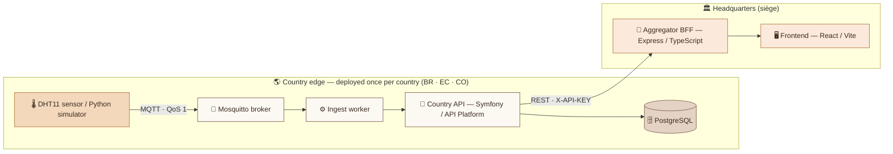
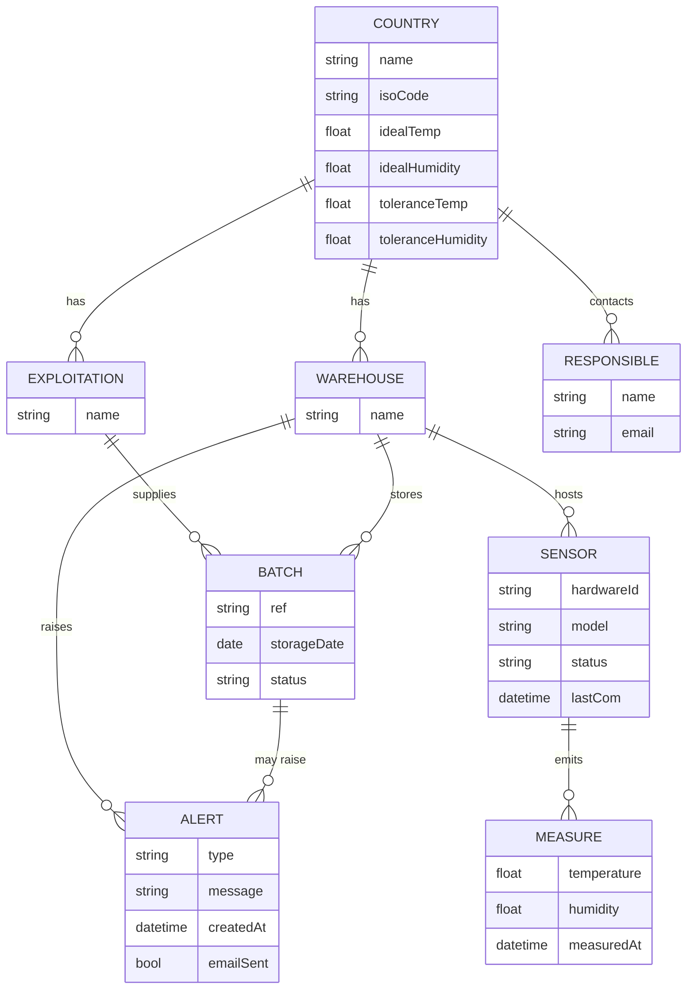
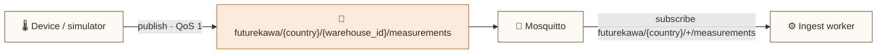
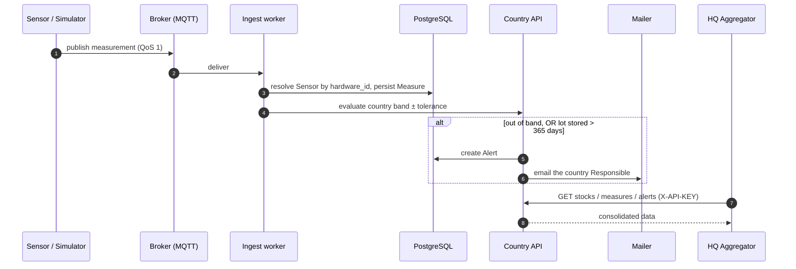
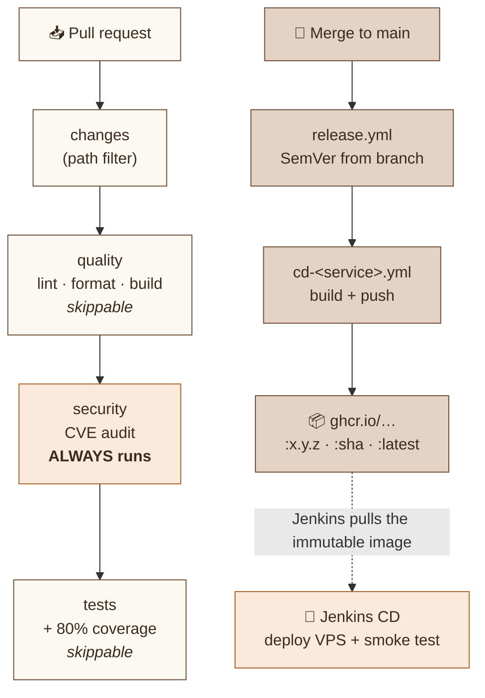
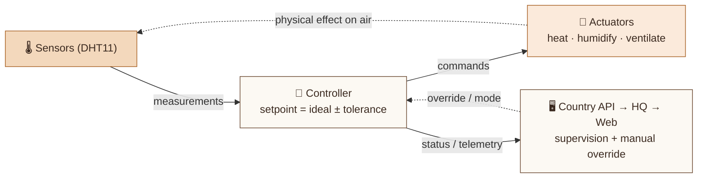
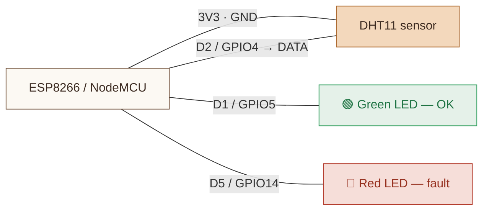

# 🎨 Diagrams (schemas)

Renderable **diagram sources** for the FutureKawa docs. Each diagram below is a
**Mermaid** source (portable, versionable) that renders to the `*.png` filename
the docs reference. Produce the PNGs with any Mermaid renderer (Docusaurus, the
Mermaid Live Editor, `@mermaid-js/mermaid-cli`) or hand them to the design tool to
redraw in the charte.

> 💡 Excalidraw sources (`*.excalidraw`) can be added alongside once drawn; the
> Mermaid here is the source of truth for content and colours.

## Charte FutureKawa — apply these colours

| Role | Hex |
|---|---|
| Ivory background | `#f3ede3` |
| Surface / boxes | `#fcf9f3` (border `#d8cdbb`) |
| Text (espresso) | `#3b2a20` |
| Coffee accent (flows, borders) | `#6f4e37` |
| Caramel **signal** (alerts, primary) | `#c77b3b` / text-safe `#a96428` |
| Sensor fill / caramel tint | `#f3d8bc` |
| Data store tint | `#e4d2c4` |
| Success / Danger | `#2e9e5b` / `#b33a2b` |

Fonts: **Archivo** (labels), **IBM Plex Mono** (code/ids). Angular corners
(4–12 px radius). Golden rule: **one caramel accent per diagram = a signal**.

Target PNGs: `architecture-distributed.png` · `data-model-erd.png` ·
`mqtt-contract.png` · `sequence-measure-to-alert.png` · `cicd-pipeline.png` ·
`phase2-automation.png` · `iot-wiring.png`.

---

## 1. `architecture-distributed.png` — sovereign edges + HQ



> Note: **data sovereignty** — each country owns its DB; HQ never holds a
> country's raw data, it queries the three country APIs and consolidates.

---

## 2. `data-model-erd.png` — per-country domain model



> A `Batch` has **two** parents (its `Exploitation` and its `Warehouse`). A
> `Measure` carries no country column — location is resolved
> `Measure → Sensor → Warehouse → Country`. `User` (auth) stands alone.

---

## 3. `mqtt-contract.png` — topic & payload



Payload (JSON, contract in `packages/contracts/mqtt/measurements.md`):

```json
{ "warehouse_id": "wh-01", "country": "brazil", "model": "DHT11",
  "hardware_id": "br-wh-01", "temperature": 24.3, "humidity": 49.9,
  "timestamp": 1783454596 }
```

---

## 4. `sequence-measure-to-alert.png` — measurement lifecycle



---

## 5. `cicd-pipeline.png` — CI gating + release + hybrid CD



---

## 6. `phase2-automation.png` — closed-loop control (phase 2)



> Reuses the phase-1 MQTT transport; adds `…/commands` and `…/actuator_state`
> topics. Safeties: hard limits, logical e-stop, manual/auto/off, watchdog.

---

## 7. `iot-wiring.png` — ESP8266 + DHT11 node

Pins confirmed from the firmware (`apps/country/iot/firmware`). Mermaid gives the
connection logic; a breadboard-style schematic can be drawn from this table.

| From (ESP8266 / NodeMCU) | To | Signal |
|---|---|---|
| `3V3` | DHT11 `VCC` | power |
| `GND` | DHT11 `GND` | ground |
| `D2` (GPIO4) | DHT11 `DATA` | 1-wire data |
| `D1` (GPIO5) | Green LED (+220 Ω) | OK / published |
| `D5` (GPIO14) | Red LED (+220 Ω) | fault / no link |


